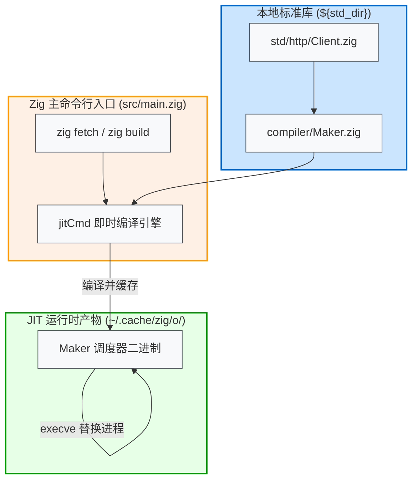

# Zig 0.17 Maker 机制与 zig fetch 代理热修复

在 Zig 0.17 中，如果配置了 HTTP 代理，执行 `zig fetch` 拉取依赖时可能会遇到连接中断或异常退出的问题。

官方 PR [#36484](https://codeberg.org/ziglang/zig/pulls/36484) 修复了 `std.http.Client` 中的相关缺陷。但在传统流程中，修改标准库通常需要重新编译整个 Zig 编译器（包含 LLVM 与 Clang 后端，耗时较长）。

本项目 [zig-maker](https://github.com/jiacai2050/zig-maker) 利用 Zig 0.17 构建调度器 **`Maker`** 的即时自举机制，在不重新编译编译器本体的前提下，实现了对调度器的热替换。本文记录其背后的工作机制与替换方案。

---

## 1. 代理缺陷与根因

### 1.1 报错现象
通过环境变量配置代理（如 `HTTPS_PROXY`）后执行依赖拉取：
```bash
$ zig fetch https://github.com/user/repo/archive/refs/tags/v1.0.0.tar.gz
Fetch
...
error: invalid HTTP response: HttpConnectionClosing
```
或者在拉取 Git 依赖时报错：
```bash
error: unable to discover remote git server capabilities: TlsInitializationFailed
```
客户端会在重试多次后异常退出。

### 1.2 根因分析
在 `lib/std/http/Client.zig` 中，代理逻辑存在两处主要问题：
1. **CONNECT 隧道握手的协议传递错误**：
   在建立代理隧道连接 `findConnection` 时，未正确继承外层请求所需的目标协议，导致后续连接复用失效；
2. **连接池清理中的重复释放（Double-Release）**：
   在 TLS 升级（TLS Upgrade）与错误回滚（`errdefer`）路径中，连接关闭与归还状态未做互斥标记，发生重复释放，破坏了连接池状态，导致后续请求被服务端直接关闭。

官方 PR [#36484](https://codeberg.org/ziglang/zig/pulls/36484) 修复了上述握手与连接池状态流转逻辑。

---

## 2. 什么是 Maker：构建调度器解耦

要理解为何“替换一个源文件即可修复 `zig fetch`”，首先需要明确 **`Maker` 是什么**。

### 2.1 从 build_runner 到 Maker
在 Zig 0.16 及更早版本中，负责执行构建逻辑的程序被称为构建运行器（`build_runner.zig`），而包管理网络下载逻辑依然打包在主编译器二进制内。

从 0.17 开始，构建与包管理体系被彻底解耦，拆分为两个独立组件：
- **`Maker`（构建调度器）**：源码位于 `lib/compiler/Maker.zig`，负责构建任务调度、文件监听（Watch）、缓存管理，以及**所有的依赖包下载逻辑（`zig fetch` 的实际底层执行实体就是 `Maker`）**；
- **`Configurer`（构建配置器）**：由 `Maker` 派生的沙箱子进程，负责执行 `build.zig` 并生成构建有向无环图（DAG）。

本项目之所以命名为 `zig-maker`，正是因为要热替换的核心目标就是这个由 JIT 编译出的 `maker` 进程。



### 2.2 jitCmd 即时编译
在 `src/main.zig:L352-L363` 中：
```zig
.build, .fetch, .init, .libc, .@"cache-cat" => {
    return jitCmd(gpa, arena, io, cmd_args, environ_map, .{
        .cmd_name = "maker",
        .root_src_path = "Maker.zig",
        .prepend_cmd = cmd,
        .prepend_zig_lib_dir_path = true,
        .prepend_global_cache_path = true,
        .prepend_zig_exe_path = true,
        .prepend_seed = true,
        .release_mode = .safe,
    });
},
```
执行流程如下：
1. `zig fetch` 和 `zig build` 命令由 `jitCmd` 统一转发；
2. `jitCmd` 定位到 `<zig_lib>/compiler/Maker.zig`，并基于当前标准库将其编译为独立可执行文件 `maker`；
3. 二进制输出至全局缓存 `.cache/zig/o/<digest>/maker`；
4. 编译完成后，通过 `process.replace`（`execve` 系统调用）直接替换当前主进程。

---

## 3. 热替换方案

在 0.17 架构下，`Maker` 的二进制缓存直接依赖其输入源码的哈希签名。

```
                    修改源文件 (Client.zig)
                             ↓
                 源码 Manifest Hash 改变
                             ↓
下一次执行 zig fetch 时，jitCmd 侦测到缓存失效
                             ↓
                 重新 JIT 编译生成 Maker
                             ↓
                 修复逻辑直接生效，无需重编编译器
```

### 3.1 定位标准库路径
不同安装方式（asdf、Homebrew、源码编译）下的 Zig 安装目录各异。通过 `zig env` 可以直接获取当前环境的标准库路径：
```zig
.{
    .zig_exe = "/path/to/bin/zig",
    .lib_dir = "/path/to/lib",
    .std_dir = "/path/to/lib/std",
    .version = "0.17.0",
    ...
}
```
提取其中的 `.std_dir` 即可定位文件：
```bash
# Query active std_dir
STD_DIR=$(zig env | awk -F'"' '/\.std_dir =/ {print $2}')
TARGET="${STD_DIR}/http/Client.zig"
```

### 3.2 替换脚本设计
[zig-maker](https://github.com/jiacai2050/zig-maker) 中的替换脚本主要完成三件事：

1. **版本校验**：
   由于修复后的 `Client.zig` 依赖 0.17 引入的 `std.Io`，脚本在执行前先确认 `zig version` 为 `0.17.x`，避免污染旧版本；
2. **备份原文件**：
   覆盖前将原始文件保存为 `Client.zig.orig`；
3. **支持还原**：
   通过 `./replace.sh --restore` 可以恢复官方原版文件。

---

## 4. 效果验证

在项目根目录下执行替换：
```bash
$ ./replace.sh
Replaced /path/to/0.17.0/lib/std/http/Client.zig (backup at .../Client.zig.orig)
```

开启 `ZIG_VERBOSE_CMD=1` 可以观察到增量编译和调用过程：
```bash
# Enable verbose sub-process logging
$ ZIG_VERBOSE_CMD=1 zig fetch git+https://github.com/jiacai2050/zig-curl.git
info: /Users/.../.cache/zig/o/4f8a.../maker fetch ...
curl-0.5.1-P4tT4cv-AABoE4oWNFmyMed5FEwutUbxJYbWx1PWjhm7
```
依赖包成功完成下载与哈希校验，`build.zig.zon` 解析恢复正常。

---

## 5. 总结

Zig 0.17 将 Maker 从主编译器静态二进制中解耦出来，并改为按需 JIT 自举，这一设计使上层构建工具更易于维护：
1. **编译器核心与上层工具解耦**：编译器主二进制无需内置复杂的应用层网络逻辑；
2. **补丁应用成本降低**：遇到标准库或 Maker 的问题时，可以直接修改源码，依赖 JIT 机制即时生效，不必等待官方发布新版本或自行重新编译编译器；
3. **保持增量构建性能**：二进制缓存机制确保源码未改变时不产生额外的编译开销。
